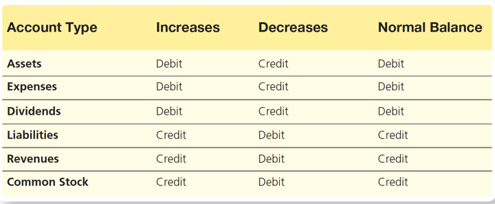
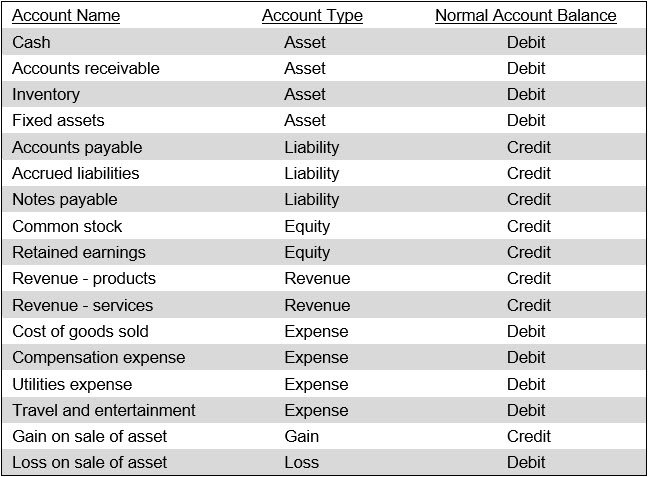

- # Resources
- [Recording Business Transactions](Recording%20Business%20Transactions.md)
- {:height 455, :width 553}
-
- {:height 326, :width 524}
- {:height 491, :width 510}
- # Examples for different accounts
- ## Products and Sales
- ### Sale Price transaction
	- For increasing sale price
		- Debit accounts receiveable
		- Credit sales revenue
- ### Product Cost transaction
	- Debit inventory
	- Credit cash
- ### Purchasing supplies
	- Credit supplies
	- Debit cash
- ## Paying salaries
	- Debit salaries account
	- Credit cash
-
