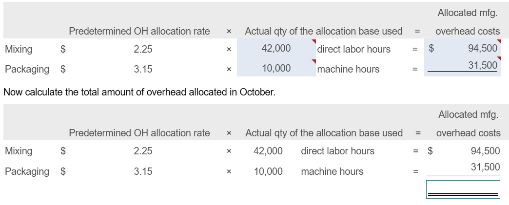
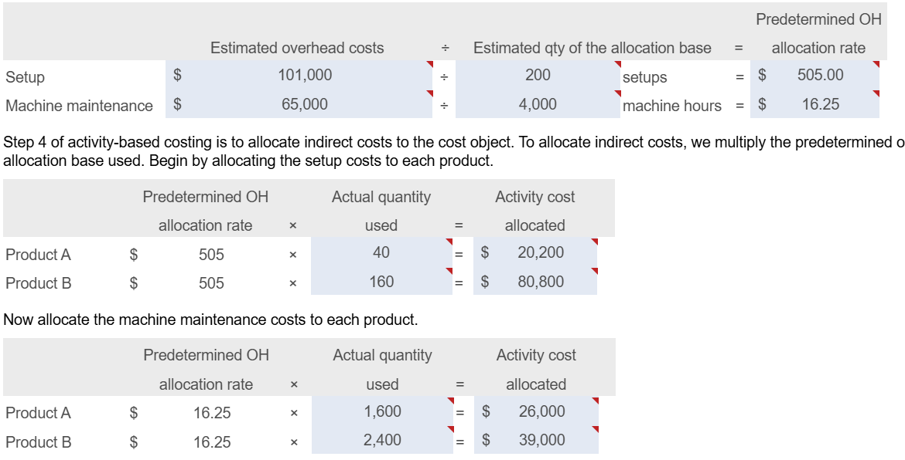

# Recording Transactions
## Inventory
### Returned inventory
      - **Debit:** Inventory Asset account
      - **Credit:** Accounts payable or cash (depending on purchase method)
### Paid in discount period
      - **Debit:** Accounts payable (full amount)
      - **Credit:** Net amount paid and either merchandise inventory  or equivalent or purchase discounts
### Selling product on account
#### Record the sale
        - **Debit:** Accounts receiveable
        - **Credit:** Inventory
#### Record transaction and product costs
        - **Debit:** Cost of Goods sold
        - **Credit:** Inventory
## Labor
### Wages
      - **Debit:** Work in Process inventory (direct) or Manufacturing Overhead (indirect)
      - **Credit:** Wages Payable
## Manufacturing
### Overhead allocation
      - **Debit:** Work in process
      - **Credit:** Factory Overhead or Applied Overhead account
### Transaction type
      - **Debit:** Finished goods inventory
      - **Credit:** Work in process inventory
-
- Predetermined overhead allocation rate = Estimated overhead allocation / Estimated qty of allocation base
  - 
- Predetermined OH allocation rate x Actual quantity of the allocation base used = Allocated manufacturing overhead
  - 
  - 
  - 
  -