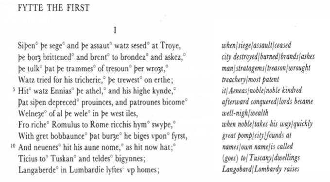
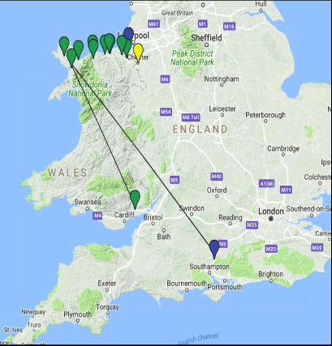
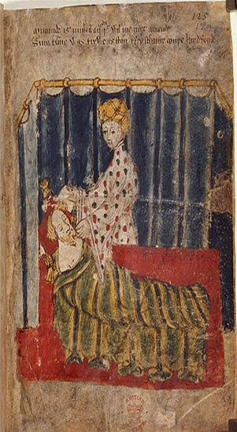
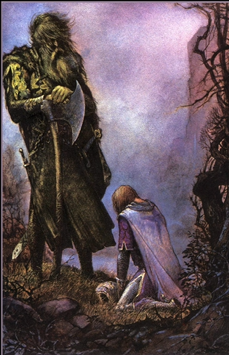

# Introduction
## About the Author
  - Major languages are Latin and French
      - French was a language of International diplomacy
      - English is emerging as a common lanuage
        - Not viewed as well as the other
  - Romance of the 1380s or possibly the 1390s
  - Might have  been Alternative Revival (throw back poem)?
  - Unknown author \rarr (Gawain-poet or Pearl-poet)
      - Author perhaps a court poet for the King
      - Poem seems to come from the northwest Midlands, may have been from Cheshire, where Richard II often kept his court
        - A bit further away from London
        - There
        - 
      -
      - What does it mean to write the poem for the king?
- Four poems in the Cotton Nero ax. manuscript (three are religious)
  - Pearl
  - Patience
  - Cleanness
  - Sir Gawain and the Green Knight
- Most of old English poetry was alternative
  - Some tie it into nationalism
  - Poem is about nationalism
- 
- **Stresses in words and stresses of alliteration in the text**
## Historical Context
### The Hundred Years War (1337-1454)
      - New French King Philip VI gives refuge to the Scottish King David II in 1334
        - In 1337 confiscated the Duchy of Aquitaine (hereditary possession of English Kings)
      - Edward III claims the throne of France by right of birth (through his mother following death of her brother, Charles IV)
      - English win important early victories in France at Crecy (1346) and Poitiers (1356)
        - Its not as much of a continuous war, on or off periods
# Fitt 1
> "Once the siege and the assault of Troy had ceased" (I)
> "So listen a little while to my tale if you will" (30)
> "the most chivalrous knights / the handsomest king" (51, 54)
> "at her place on the platform, pricelessly curtained I by silk to each
> side, and canopied across / with French weave and fine tapestry from
> the far east" (75-77)
  - Not beginning with the English story, but rather the story of their ancestors
      - Back to the foundations
> "He [Arthur] brimmed with ebullience being almost boyish / / His
> blood was busy and he buzzed with thoughts" (85, 89)
> "a mountain of a man immeasurably high, I a hulk of a human from
> head to hips, / / I should genuinely judge him to be a half giant, / or a
> most massive man, the mightiest of mortals" (137-38, 140).
> "otherworldly, yet flesh / and bone" (198)
  - Presented as a youthful king
  - Should be assumed to be a massive man/ half gaint
      - Not quite a giant, but a massive man
      - Almost supernatural but not quite
  - Almost a king of Beowulf figure
> "They gaped and they gawked" (232)
> "were like statues in their seats, / left
> speechless and rigid, not risking a
> response" (241-42)
  - The audience is shocked
> "because your acclaim is so loudly chorused,
> And your castle and brotherhood are called the best,
> the strongest men to ever mount the saddle,
> the worthiest knights ever known to the world,
> both in competition and true combat,
> and since courtesy is championed here,
> I'm intrigued, and attracted to your door at this time."
> (258-63).
  - Courtesy is paramount here
  - The strongest, worthiest, the most chivalrous
> "Besides, / the bodies on these benches are just bum-fluffed
> bairns [children]" (279-80)
> "So who has the gall? The gumption? The guts?" (291)
> "So here is the House of Arthur," he scoffed" (309).
  - There is a sense because he wants to offer the best, right, this challenge
  - Knights and youth
  - Throws down the contest with the axe
      - Due to claim to be the best
      - Looking for someone in the room to come forward and challenge him, but no one does
> "Then Arthur grips the axe,
> grabs it by its haft / and takes
> it above him, intending to
> attack" (330-31
> "Gawain / now to his king
> inclines / and says, "I stake
> my claim. / This moment
> must be mine" (339-42).
  - Takes the axe and intends to attack
  - Too prestigious for this sort of game
  - This moment must be mine
> "you must solemnly swear
> that you'll seek me yourself, that you'll search me out
> to the ends of the earth to earn the same blow
> as you'll dole out today in this decorous hall."
> (394-97)
> "You're charged with getting to the Green Chapel" (451).
> [oaths/reciprocity] "reap what you've sown" (452)
  - The terms are clear
  - What is this contest
# Fitt 2&3
- Laugh and grin with the green man gone \rarr almost a celebration
  - The wall is hung on the wall as a sort of symbol of thier joy
> for men might be merry when addled with mead / but each
> year, short lived, is unlike the last" (497-98)
> (566-669) long, descriptive passage that diverges from the main
> narrative
  - A passage diverges from the main narrative just to tell us how to lose the passage of time
      - Trying to go find the green knight
      - Serves to Heighten tension
## Themes
  - The pentangle (the endless knot) \rarr Five fives
      - Five senses
        - Through the senses we can be tempted
      - Five fingers
        - Can resist temptation
      - Five wounds
        - Christs crucifiction
      - Five joys
        - Joys of  Mary
      - Five virtues
  - The five joys of Mary \rarr part of the pentagonal
      - Annuciation
        - Coming birth of christ
      - Nativity
        - Birth of christ
      - Resurrection
        - Ressurected
      - Ascension
        - Ascension of Christ
      - Assumption
  - Five virtues
      - Generosity (friendship)
      - Fellowship (fraternity)
      - Chastity (purity)
      - Courtesy (politeness)
      - Compassion (pity)
> "To find his equal on earth would be far from easy.
> Cleverer to have acted with caution and care,
> deemed him a duke—a title he was due—
> a leader of men, lord of many lands;
> better that than being battered into oblivion,
> beheaded by an ogre through headstrong pride.
> How unknown for a king to take counsel of a knight
> in the grip of an engrossing Christmas game."
> (476-83)
> "He wanders near to the north Of Wales
> with the Isles of Anglesey off to the left.
> He keeps to the coast, fording each course,
> crossing at Holy Head and coming ashore
> in the wilds of the Wirral, whose wayward people
> both God and good men have quite given up on."
> (697-702)
  - 
- The person who was beheaded head falls and where is falls water springs up
- They have gone to this kind of dangerous wilderness
> "Father, hear me, / and Lady Mary, our mother most mild, / let
> me happen on some house where mass might be heard, / and
> matins in the morning" (753-56)
  - Is miserable and prays to god that things can get better
> "The knight had not seen a more stunning structure" (793).
> "Then he went on his way, but came back at once / with a group who had
> gathered to greet the stranger; I the drawbridge came down and they crossed
> the ditch / and knelt in the frost in front of the knight" (815-18).
> "Curtains ran on cors through red-gold rings, / tapestries from Toulouse and
> Turkistan / were fixed against walls and fitted underfoot" (858-59).
> "She was the fairest amongst them I / more glorious than Guinevere, or
> so Gawain thought" (943, 945)
  - The men who he encounters respect him
  - The castle that he encounters is similar to Arthurs court mentioned at the beginning of the story
  - A beautiful wife and an amazing castle
> "Once the master has gathered that his guest is Gawain
> he thinks it so thrilling he laughs out loud.
> All the men in the manor were of the same mind,
> being keen and quick to appear in his presences,
> this person famed for prowess and purity,
> whose noble skills were sung to the skies,
> whose life was the stuff of legend and lore.
> *Then knight spoke softly to knight, saying
> "Watch now, we'll witness his graceful ways,
> hear the faultless phrasing of flawless speech"
> (908-918)**
  - Told of how young the lord is
  - Hear about his great reputation, partially out of courtesy
  - The green knight arrives to see if it is true
> "The place you need is near, I
> two miles at most away" (1077-78).
> "Here's a wager: what I win in the
> woods will be yours, / and what
> you gain while I'm gone you will
> give to me" (1106-7).
  - Given a great room and warm clothes
  - This place is a dream
  - The place that he wants to find is the Green Chapel
      - Only 2 miles ahead
  - Celebrate Christmas before he heads to the green chapel
  - Another example of reciprocity
> "so through a lime-leaf border the lord led the
> hunt, / while snug in his sheets lay slumbering
> Gawain" (1178-79)
> "You're tricked and you're trapped!" (1210)
> "Gawain is a gentleman and remains on guard"
> (1282).
> "But I know that Gawain could never be your
> name" (1293).
  - Lord goes out on a hunt for deer while Gawain is sleeping in his bed
  - Innocent kiss
> "Are you pleased with this pile? Have
> I won your praise?" (1379-80)
> "So he held out his arms and hugged
> the lord / and kissed him in the
> kindliest way—to my one profit, I
> though I'd gladly have given you any
> greater prize" (1388-91)
  - *effictio*- the dressing of the deer
  - "Holds out his arms and hugged the lord"- "and kissed him"
## Other historical information
  - Medieval Canonical Hours
      - |Name|Equivalent|
        |--|--|
        |Matins|3 AM|
        |Lauds|5 AM/Sunrise|
        |Prime|6 AM|
        |Terce |9 AM|
        |Nones|3 PM|
        |Vespers|6 PM|
      - Eversong would have been a service of religious songs
      - Told about this through a variety of liturgical books
# Fitts 3&4
- 
> "the biggest of wild boars has bolted
> from his cover" (1441)
> "So the day was spent in pursuits of this
> style, / while our lovable young lord had
> not left his bed" (1468-69)
  - Hunting the boar
  - Involves the lord going out again in order to pursue the boar
  - More parallels \rarr juxtaposition of the hunt
  - Lord Gawain had not left his bed (passive creatures)
  - Must confront the woman
  - Cannot beat Gawain
  - Man dedicated to his duty can not ignore
> "l encouraged you to kiss" (1489).
> "he hobbled away to hunker in a hole /
> by a stony rise at the side of the stream"
> (1569-70).
  - Retorts back to courtesy
  - Kind of tension between them
  - Going between this and the hunt for the boar
  - Kind of a seduction
  - Dodge her advances in order to get out of the situation
  - The Boar is subdued by the Lord
> "Then, admiringly he handles the hog's
> great head, / feigning fear to flatter the
> master's feelings" (1633-34).
  - Irony when be being given the head of the boar since he was the one that did the beheading
  - Has continued to kiss the lady
> "And so loving was that lady towards the young lord, / with stolen
> glances and secret smiles / that it muddled his mind and sent him half
> mad, / but to snub a noblewoman was not in his nature, / and though
> tongues might wag he returned her attention all night" (1657-62).
> "l have tested you twice and found you truthful. / But think tomorrow
> third time throw best' (1679-80).
  - Gawain is struggling
  - Cannot snub the noblewomen's advances
  - He is playing a fine line
> "Often, in the open, the pack tried to
> pounce, / then that crafty Reynard
> would creep into coved' (1727-28)
> Why these animals?
  - The lord continues to hunt
> "in this manner through the mountains until midafternoon, / while our handsome hero snoozed contentedly at home" (1730-31).
> "She wore nothing on her face; her neck was naked, /and her shoulders were bare to both back and breast" (1740-41).
> "They talk with tenderness / and pride, and yet thei rplight / is perilous unless / sweet Mary minds her knight"
  - Set up these parallels
  - We know that the lady is going to come again
  - He is within the bed without being under the covers
  - She is really pressing now
  - Neck was naked and her shoulders were bare
  - Passionate heat takes a hold in his heart
  - He is in peril at this moment
> "There is no other one, / and won't be for a while!" (1791
> "Will you give me some gift—a glove at least" (1799).
> "She offers him a ring of rich, red gold" (1817).
> "so I give you my girdle, a less thing to gain" (1829).
> "Then fully and frankly he spoke of his sins" (1880).
  - He pushes back onto the lady \rarr this is not going to happen
  - The lady offers him a ring of rich red and gold
      - He refuses again
      - He refuses other gifts that the lady offers him
      - He intended to take neither gold nor girdle
  - Like a fox how can he slip away out of this
      - Wants to avoid this fate
  - 
> "Then red fur rips—Renyard / out of
> his pelt is prized" (1920-21).
> "His blue robe flowed as far as the
> floor, / his soft-furred surcoat suited
> him well" (1928-29).
> "He clasps him tight and kisses him
> three times" (1936).
  - Rise to the dead fox
  - Tries to move past his relationship with the lady
  - 
  -
> "So let him lie and think,
> in sight of what he sought.
> In time I'll tell if tricks
> work out the way they ought." (1994-97)
> "But our man bore the belt not merely for its
> beauty, / or the appeal of its pennants, polished
> though they were, / or the gleam of its edges which
> glimmered with gold, / but to save his skin when
> presenting himself' (2037-40)
  - 
  - Time for Gawain to prepare to leave
  - Takes the belt in order to save his skin
> "In that wilderness lives a wildman, the worst in the
> world, / he is brooding and brutal and loves
> bludgeoning humans" (2098-2099)
> "Green Church?" chunters the knight. / "More like
> the devil's lair / where, at the nub of night, / he
> makes his morning prayer" (2185-88).
> "This is a haunted house—may it go to hell" (2195)
  - In the wilderness lives a crazy serial killer
      - Brooding and brutal and loves to bludgeon humans
  - Medieval audience would have said that he is trying to use his own sort of magic with this girdle
  - Its similar to going to the devils lair/ a haunted house
      - A disturbing place
      - A soulless spot
> "that grinding is a greeting. / My arrival is honored with the honing of an axe" (2205-6).
> "Call yourself good Sir Gawain?" (2270).
> "it skewed to one side, just skimming the skin / and
> finely snicking the fat of the flesh / so that bright
> red blood shot from the body to earth" (2311-14).
  - 
  - A camoflauge man
  - Pulls out an axe
      - The blade has been sharpened by this giant of a man
  - He was not afraid
  - The same sort of insults that he had hurled at Arthurs court
  - He runs away and then his horse is right there
  - This is as one of Arthurs male kin becomes the king
      - He is facing this
  - Recognizes his own failings and takes off the green girdle
      - He realizes the fate that he was trying to avoid anyway
      - He has one more chance to do the right thing
      - I must take this off before you take your swing at me
  - "Do you walk the walk as well as talk the talk"
  - Knows that his death is coming
  - The threes- three days of hunting, three days of seduction, three days of exchange
> "my first strike fooled you—a feint, no less—
> not fracturing your flesh, which was only fair
> in keeping with the contract we declared that first night,
> for with truthful behavior you honored my trust
> and gave up your gains as a good man should.
> Then I missed you once more, and this for the morning
> when you kissed my pretty wife then kindly kissed me.
> The third time, though, you strayed,
> and felt my blade therefore."
> (2345-49, 2356-57)
> "But a little thing more—it was loyalty that you lacked: /
> not because you're wicked, or a womanizer, or worse,
> / but you loved your own life; so I blame you less"
> (2366-68).
> "By confessing your failings you are free from fault"
> (2391
> "All wrecked and ruined by their wrongs; if only / we
> could love our ladies without believing their lies."
> (2420-21
  - We want to save our lives as humans
  - Cannot be blamed for his life actions \rarr and the actions of the women that seduced him
> "as a sign of my sin—I'll see it as such /
> when I swagger in the saddle—a sad
> reminder / that the frailty of his flesh is
> man's biggest fault" (2433-35).
> "In my manor lives Morgan la Fay" (2446)
> "To put pride on trial and to test with this
> trick / what distinction and trust the Round
> Table deserves" (2157-58).
  - A touch of filth taints his frame
  - Always keep him humble when he is swaggering in the saddle
  - Finds some humility
  - Tests them to see if their reputation is true
  - Wants to undermine her brother again
      - We go back to the beginning of the text
> "He grimaced with disgrace, / he writhed
> in rage and pain. / Blood flowed towards
> his face / and showed his smarting
> shame" (2501-4).
> "The king gave comfort, then laughter
> filled the castle" (2513).
  - 
  - Another sort of confessional mode
  - Gawain was not killed by the Green Knight because he was so great
  - The girdle becomes a sign of brotherhood
  - We go back to the beginning of the text and the assault on Troy
      - The motto: "Hony Soyt Qui Mal Pence" ("Shame to him who thinks eviol of it")
      - The motto of the order of the girdle
      - This was a royal society of King Edward III
      - We still have this today, and you sometimes see royals wearing clothes from the order of the Gartle
# Overall Themes
## The Girdle
  - **To Arthurs Knights:**
      - Gawain's survival
      - Loyalty to brothers
      - Overcoming adversity
      - Gawain's victory
  - **To Gawain:**
      - Sign of sin
      - Sign of Human nature
      - A failure of his knightly code
## Repetition
  - Gender?
      - Who is in charge?
      - Is Morgan's test noble or treacherous?
  - Do Arthur and his knights "get" the message of the "blazon of blame"
  - We also begin and end in the same place
  - Not aware of Gawain's failures
## The Monster Stands at the Threshold of Becoming
  - "Monsters are our children"
  - Monsters ask us how we perceive our world and how we have misrepresented what what have attempted to place"
  - The beg us to reconsider our cultural disparities of economics, gender and sexuality
  - How do the people in the court react to the presence of the monster in the court
## Other
  - What does Arthur expect of the world for himself? What is the norm for the king and ruler?
  - How does the Arthurian court misperceive its own place in the world?
  - What gender norms are set up by the poem and where does it radically veer from these expectations?
  - What is the difference between power and and oppression? What about between confidence and pride? What is the reason for the Green Knight in the first place?
  -