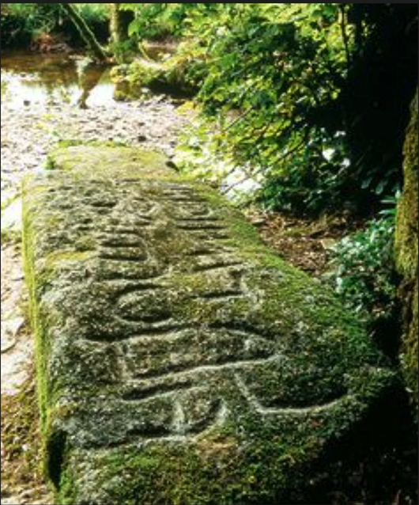
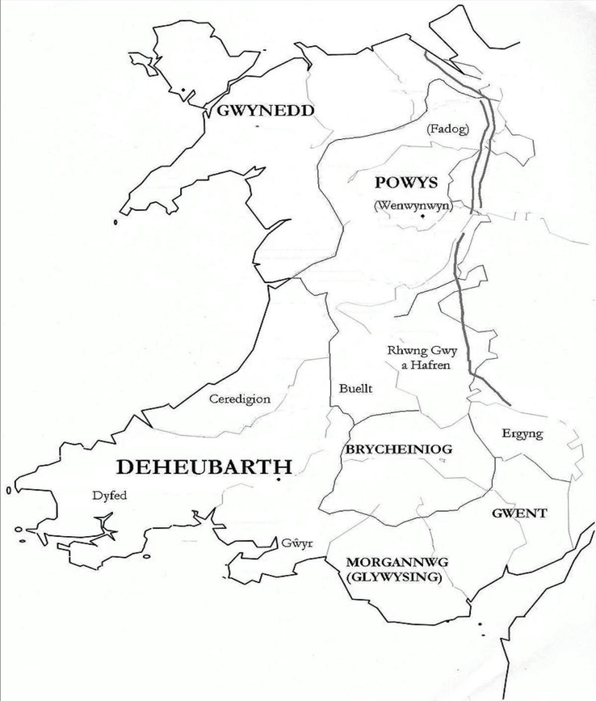

# The Mabinogion Branch 1
## Introduction
  - White book of Rydderch (1350)
  - Red book of Hergest (1382-1410)
  - 4 branches probably by one author
      - Other stories by many authors
      - Might have been a court text
  - Lady Charlotte Guest (1812-1895)
      - Translated the tales into English in the mid-nineteenth century
      - Gave the text its names: Mabingion
      - Mab = son
        - Songs of the sons
      - Subsequent translations of the story into other languages
  - Three stories correspond to famous romances by the French poet Chretien de Troyes (also possibly a court poet)
      - Not much known about the writer
      - Not simply the written version of oral tales, product of **slow development** of oral tales that were part of the collective memory
        - Might have also combined many different smaller stories into one larger one
      - King Arthur appears in five of the stories
## Early Latin Histories
### Gildas
      - Gildas (died in 570)- A British Monk who wrote *De excidio et conquestu Britanniare* (On the destruction and conquest of Britain)
        - Mentions the Battle of Mt. Badon (Mons Badonicus) fought around 500 CE
        - Ambrisius Aurelianus (Possibly Arthur) is a resistance leader of the Britons
          - Britons fight against the invading Saxons
> "...a gentleman who, perhaps alone of the Romans, had survived the shock of this notable storm: certainly his parents, who had worn the purple, were slain in it. His descendents in our day have become greatly inferior to their grandfather's excellence."
            - Parents who wore the purple (symbol of Rome)
            - Britons deserved this conquest
### Nennius and the Annales Cambriae
      - Nennius is a ninth-century Welsh monk
        - Writes Hsitoria Brittonum of "Arthur" the Christian *dux bellorum*who died at Mount Badon
        - Nennius notes the story of Vortigens tower and a boy, Ambriosus (Merlin) who explains the towers failure
          - Merlin is mysterious in his Answer
        - Symbolism of the dragon, especially in Wales
        - *Annales Cambriae* covers the years between 533 to 970 CE
          - Also the battle of Carmlann/Camblan in 539 CE between Arthur and Medraut (Mordred)
### Arthurs Stone in Camelford
      - 
> LATINI IACIT FILIUS MA....RI
      - Roman son of unknown
      - May have been the site of the Battle of Ricer Camblan
### Medieval Wales
      - 
      - 4 Kingdoms
        - Smaller areas inside the Kingdoms
## The Mabinogion
  - A text of Welsh culture and nationalism?
  - The Normans had settled extensively in Wales and on the borders (the marches) between Wales and England after the Norman Conquest of England in 1066
  - In 1282, last Welsh King Llewellyn ap Gruffudd was killed and therefore the English basically conquered Wales
      - They speak English and Welsh now
        - Constant awareness of the National language
      - Subsumed their culture
        - Welsh Language blended into the English Culture
      - Multiple Kingdoms combined under one rule
      -
## The First branch
### Prince Pwyll of Dyfed
      - Then a rider came up to him and spoke to him like this:
> "Sir, I know who you are, but I will not greet you"
> "Sir, if I have done wrong, I will redeem your friendship"
      - White dogs with red earsDogs have captured a stag (deer)
        - Poole drives them off so his own dog can have the carcass of the deer
        - How can he repay the stranger
### Arwan, king of Annwfn (the Otherworld)
> '"What I shall do is to put you in my place in Annwfn, and give you the most beautiful woman you have ever seen to sleep with you every night, and give you my face and form so that no chamberlain nor office nor any other person who has ever served me shall know that you are not me" (4). 
> '"there is a meeting between him [Hafgan] and me at the ford . one blow—he will not survive it"' (4). . give him only
      - Annwfan is like a parallel world to the real world
      - Lots of talk about the Mountains \rarr the entrance to the otherworld
> "Time came for them to go to sleep, and they went to sleep, he and the queen As soon as they got into bed, he turned his face to the edge of the bed, and his back to her. From then to the next day, he did not say a word to her. The next day there was tenderness and friendly conversation between them. Whatever affection existed between them during the day, not a single night until the end of the year was different from the first night" (5).
> '"all of you should stand aside and leave the fighting between the two of them"' (6). "And at the first attack, the man who was in Arawn's place strikes Hafgan in the centre of the boss of his shield, so that it splits in half, and all his armour shatters, and Hafgan is thrown the length of his arm and spear-shaft over his horse's crupper to the ground, suffering a fatal blow" (6). "And by noon the following day both kingdoms were under his authority" (6).
      - Humans are ruled by Pwith authority
      - Arawn gave to Pwyll prince of Dyfed, proper form and features and took back his own
> In Annwfyn: "And then he though, 'Dear Lord God,' he said, 'l had a friend whose loyalty was steadfast and secure.' And then he said to his wife, 'Lady,' he said, 'do not blame me. Between me and God,' he said, 'l have neither slept nor lain down with you for the past year"' (7).
> In Dyfed: '"Lord,' they said, 'never have you been so perceptive; never have you been such a kind young man; never have you been so ready to distribute your wealth; never have you ruled better than during this year"' (8).
      - After a year in each others Kingdom deal worked well in order to improve their own Kingdoms
> "He sat on a mound. And as they were sitting, they could see a woman wearing a shining golden garment of brocaded silk on a big, tall, pale-white horse coming along the highway that ran past the mound" (8). 
> "He followed her as fast as he could on foot. But the greater his speed, the further she drew away from him" (9). 
> "Then Pwyll said, 'Maiden,' he said, 'for the sake of the man you love most, wait for me"' (10).
      - Sitting on the mountain, they see a woman wearing a shiny golden garment of brocaded silk riding a horse
        - Even though she does not speed up Boseman's man can not catch up to her or truly make up any ground
        - Another man tries and he can not catch her either
        - Yells for the Maiden to stop
> '"l am Rhiannon, daughter of Hyffaid Hen, and I am to be given to a husband against my will. But I have never wanted any man, because of my love for you. And I still do not want him, unless you reject (11)
> "Pwyll got ready with ninety-nine horsemen. He set off for the court of Hyfaid Hen, and he came to the court and they welcomed him" (11). 
> "As they began to carouse after eating, they saw a tall, regal, auburn-haired lad enter, wearing a garment of brocaded silk.... 'l will make my request"' (11-12)
        - Rhiannon does not want him unless she is rejected
> "'Whatever you ask of my, as long as I can get it, it shall be yours"'
> '"Oh!' said Rhiannon, 'why did you give that answer?"' (12). 
> '"The woman I love most you are to sleep with tonight. And it is to ask for her, and for the preparations and provisions that are here that I have come"' (12).
        - Wishes to get out of this mess
        - Will meet again in one years time
        - Needs to overthrow her suitor and finally marry her himself
> '"Friend,' said Gwawl, 'will your bag ever be full?' 'Never, between me and God,' he said, 'no matter what is put in it, unless a nobleman endowed with land and territory and power gets up and treads down the food in the bag with both feet and says, "Enough has been put in here""' (13-14). 
> *"Pwyll turns the bag so that Gwawl is head over heels in it, and quickly he closes the bag and ties the knot in the strings and sounds his horn" (14).** 
> "As each one of Pwyll's men entered, he struck the bag a glow and asked, 'What's in here?"' (Badger in the Bag)
        - Otherworld aspects of this
          - Rhiannon is otherworldly
        - Admits that he will not fight anymore
> "But in the third year the noblemen of the land began to worry at seeing a man whom they loved as much as their lord and foster-brother without an heir" (16) ' . 
> take another wife from whom you may have an heir. You will not live forever" (16). 
> "Before the whole period had elapsed, a son was born to him" (16). "Six women were brought to the chamber. They kept watch for part of the night; however, before midnight each one fell asleep, and woke up towards cock-crow" (16).
        - Son is born of Paul and Rhiannion
          - Fall asleep and the baby vanishes
> "'Let us kill some of the pups, and smear Rhiannon's face and hand with the blood, and throw the bones beside her, and swear that she herself destroyed her son"' (16). 
> "This is what it was: to stay at that court in Arberth for seven years. And there was a mounting-block outside the gate—to sit by that every day, and tell the whole story to anyone whom she thought might not know it, and offer to carry guests and strangers on her back to the court if they permitted it. But rarely would anyone allow himself to be carried. And so she spent part of the year" (17).
        - Make it so Rhiannon believes that she has killed her son in a fit of rage by smearing the blood of slaughtered dogs onto her
          - Rhiannon is convicted of the crime
> "At that time Teyrnon Twrf Liant was lord over Gwent Is Coed, and he was the best man in the world. In his house he had a mare, and throughout his kingdom no stallion or mare was more handsome. And every May eve, she would give birth, but no one knew at all what became of her foal" (17).
        - Teyrnon gets up to examine the sturdiness of the foal (one of the best horses in Wales)
        - Hears a loud noise and a large claw comes through the window and grabs the foal and takes it
          - Teyrnon gets up and cuts the arm of the creature off
          - Reveals a child which he and his wife will raise until they can truly understand what it is
> Teyrnon Twrf Liant listened out for news and enquired constantly about the matter, until he heard increased complaints about the wretchedness of Rhiannon's misfortune and punishment from the very many people who visited the court. Teyrnon reflected on this, and looked closely at the boy" (19). 
> *"'And this is your son, my lady,' said Teyrnon. 'And whoever told lies against you did you wrong. And when I heard of your affliction, I was saddened, and distressed. And I imagine there is no one in this entire company who does not recognize that the boy is Pwyll's son"' (20).** 
> "'My lady,' said Pandaran Dyfed, 'you have named your son well—Pryderi; Pryderi son of Pwyll Pen Annwfn suits him best"' (20).
        - Rhiannons son is revealed to be alive
## The Second Branch
  - Bendigeidran son of Llyr is crowned king of "this island" "With the crown in London"
      - Brothers: Manawydan, Nysien and Efnysian (equate to "close" and "not close")
> "As they were sitting there, they could see thirteen ships coming from the south of Ireland...they saw a shield being raised above the deck, with the point of the shield upwards as a sign of peace" (22)"
      - Spot 13 ships coming from the south of Ireland but does not seem to be planning an invasion
  - Matholwch, King of Ireland
> '"He wishes to unite your two families, lord,' they said. 'He has come to ask for Branwen daughter of Llyr, and if you agree, he wishes to join together the Island of the Mighty and Ireland so that they might be stronger"' (23).
> "They all set off for Aberffraw, Matholwch and his retinue in the ships... They were not in a house, but in tents. Bendigeidfran had never been able to fit inside any house" (23).
  - Physician goes for the horses
  - King fears for himself and leaves
> '"Let Matholwch come and see me,' he said, 'and I will make peace on whatever terms he wishes"' (25).
> "Bendigeidfran and Matholwch began to converse. But it seemed to Bednigeidfran that Matholwch's conversation was lifeless and sad, whereas he had always been cheerful before that" (25). 
> '"l will increase your compensation, too,' said Bendigeidfran. 'I will give you a cauldron, and the property of the cauldron is that if you throw into it one of your men who is killed today, then by tomorrow he will be as good as ever except that he will not be able to speak"' (25).
> '"l was hunting in Ireland one day, on top of a mound overlook a lake called the Lake of the Cauldron. I saw a large man with yellow-red hair coming out of the lake with a cauldron on his back. He was a huge, monstrous man, too, with an evil, ugly look about him; and a woman followed him; and if he was large, the woman was twice his size" (26).
> "l took them in to maintain them: they were with me for a year. During that year no one objected; but from then on people resented them" (26). 
> "And then the family took counsel in the middle of the chamber; and the husband waited until the iron wall was white. And because of the great heat, he charged at the wall with his shoulder and broke out through it, with his wife following" (27).
      - Sees a man with Red hair coming out of the lake with a cauldron on his back
      - A frenzy is stirred up so the population is afraid of the giants
        - Try to kill the giants by burning the iron house with them inside
        - Once it gets to melting point they break out by opening the wall
      - Murmuring of dissatisfaction
> '"Now, lord,' said his men to Matholwch, ' set an embargo on the ships, and the rowing-boats and the coracles, so that no one may go to Wales; and whoever comes here from Wales, imprison them and do not let them return in case they find out what is happening"' (28). 
> "In the meantime Branwen reared a starling at the end of her kneading-trough, and taught it to speak, and told the bird what kind of man her brother was. And she brought a letter telling of her punishment and dishonour. The letter was tied to the base of the bird's wings, and it was sent to Wales" (28).
      - Not happy about his sister's treatment
      - Guide comes across the mountain
> "Bendigeidfran and the army we mentioned sailed towards Ireland, and the sea was not wide then; Bendigeidfran waded across" (28). 
> '"Yes, lord,' they said, 'we could see a huge mountain beside the forest, and it was moving, and there was a very high ridge on the mountain, and a lake on each side of the ridge; and the forest, and the mountain, and all of it was moving"' (29). 
> '"Nothing, except that he who is a leader, let him be a bridge,' said Bendigeidfran. 'I will be a bridge,' he said" (30).
      - **Clarified the hereditary rights to their son**
> '"And Matholwch is giving the kingship of Ireland to Gwern son of Matholwch, your nephew, your sister's son, and will invest him in your presence, to make up for the injustice and injury that was done to Branwen"' (30). 
> "...the Irish had a cunning plan. They placed a peg on either side of each column of the one hundred in the house, and hung a hide bag on each peg with an armed man in each one of them" (31) 
> "Efnysian prodded the bag until he found the man's head, and he squeezed the head until he could feel his fingers sinking into the brain through the bone" (31).
      - Planning a massive feast
      - Deceptive feast \rarr planning an ambush
        - Distrust of the Irish may have saved some lives
        - Finds out that there are many of these bags
> '"l confess to God,' said Efnysian to himself, ' the outrage I shall now commit is one the household will never expect"' (31).
> "When Efnysian saw the corpses, and no room anywhere for the men of the Island of the Mighty, he said to himself, 'Oh God,' he said, 'woe is me that I am the cause of this mountain of men of the Island of the Mighty; and shame on me,' he said, 'unless I try to save them from this"' (32). 
> "There was no real victory except that seven men escaped, and Bendigeidfran was wounded in the foot with a poisoned spear. The seven men who escaped were Pryderi, Manawydan, Gligau son of Taran, Taliesin, Ynog, Gruddieu son of Muriel, and Heilyn son of Gwyn Hen" (32).
      - Many corpses in the cauldron
      - No room for his own men
      - Breaks the cauldron and kills him in the process
> "Then Bendigeidfran ordered his head to be cut off. ' And take my head,' he said, it to the Gwynfryn in London, and bury it with its face towards France"' (32).
> And carry "And so long as you do not open the door towards Aber Henfelen, facing Cornwall, you can remain there and the head will not decay"' (32).
> '"Oh son of God,' she said, 'woe that I was ever born. Two good islands have been laid waste because of me!' She gives a mighty sigh, and with that her heart breaks"' (33).
      - Remaining survivors should make their way to Harlem
      - Braunwyn has endured too much heartache and dies of a broken heart
> "Then they went to Harlech, and sat down and were regaled with food and drink. As soon as they began to eat and drink, three birds came and began to sing them a song, and all the songs they had hear before were harsh compared to that one" (33).
> "At the end of the seventh year they set out for Gwales in Penfro. There was a pleasant royal dwelling for them there, above the sea, and there was a large hall, and they went to the hall. They could see two doors open; the third door was closed, the one facing Cornwall" (33). 
> "And there they spent eighty years so that they were not aware of ever having spent a more pleasurable or more delightful time" (33-34).
> "One day Heilyn son of Gwyn said, 'Shame on my beard unless I open the door to find out if what they say about it is true"' (34). 
> 
> "Although the road was long, they came at last to London and buried the head on the Gwynfryn. 
> 
> "In Ireland no one was left alive except for five pregnant women in a cave in the wilds of Ireland ... And they searched the country where battles had taken place, and found gold and silver until they grew wealthy" (34).
      - Three birds came to sing them a song,
      - See many doors \rarr the third one being the ones that the guard spoke of
      - Spend 80 years
      - Time is not really passing, stuck in this kind of pleasurable state
      - Opens the third door and looks out to Cornwall
        - Clear that all the ills that had befallen were there
      - They travel with the head to London
        - The head will be placed at one of the strongholds of the English monarchy
      - **Cultural denigration is the theme of the text**
        - Independence is only achieved in 1922
## The Third Branch
> "'Alas, Almighty God, woe is me!' he said. 'l am the only one who has no place to go tonight"' (35). 
> "'The seven cantrefs of Dyfed were left to me,' said Pryderi, ' and Rhiannon, my mother, lives there. I shall give her to you, together with the authority over those seven cantrefs .... My wife is Cigfa, daughter of Gwyn Gloyw,' he said. 'Although the realm will be mine in name, let the benefits be yours and Rhiannon's. And if you ever wanted a realm of your own, perhaps you could take that one"' (35).
> "Then Manawydan and Rhiannon sat together and began to converse; and as a result of that conversation his head and heart grew tender towards her" (36).
      - Island is now ruled by Pydredi's Cousin Cadwell
      - Pyderi and his family have nowhere to go
      - Rhiannon and other characters being to coalesce in this third branch
      - The characters become more comfortable with each other
> "They began a feast at Arberth .... As they were sitting there they heard a tumultuous noise, and with the intensity of the noise there fell a blanket of mist so that they could not see each other. And after the mist, everywhere became bright" (36-37). 
> "They came to the hall; there was no one. They went to the chamber and sleeping-quarters; they could see no one. In the mead-hall and kitchen, there was nothing but desolation. ...Each of them began to wander through the land and realm to see whether they could find either a building or a dwelling-place; but nothing at all did they see" (37) 
> "Let us go to England, and seek a craft by which we may make our living" (37).
      - Fredrick goes to Oxford in order to pay homage to his cousin the King
      - They can not find anyone in the home \rarr "Nothing but desolation"
      - The only people in all of wales
      - Carry on for about two years and then decide to return to England and become craftsman
> "All the saddlers realized that they were losing their profits, and that nothing was being bought from them unless it could not be supplied by Manawydan. So they got together and agreed to kill him and his companion. But in the meantime the two of them received a warning, and discussed whether they should leave town" (37).
> '"Between me and God,' said Pryderi, ' my advice is not to leave the town but rather to kill these churls"' (37).
> *'"We will make shields..." (38); 'we will take up shoemaking' (38)**
      - A change is occurring in the European economy
        - European economy is mainly agrarian
        - But an increasing amount of mercantile trade
        - Original system of nobles and peasants, but after the black plague a shift occurred \rarr you no longer needed to be a noble person to have money or influence
          - Craft guild,etc in major cities have increasing influence
            - As shown in Canterbury Tales
          - Welsh nobles head to England to live as craftspeople
            - Excellent at their work and make the other crafts people jealous
            - Original craftspeople decide that they will work to kill the new craftspeople
              - Dangerous market
            - The nobles decided to simply move onto another town and pursue another trade in order to compete and earn a living (saddle making to shield making or other)
> "Although the road was long, they came at last to Dyfed, and made for Arberth where they kindled a fire, and began to support themselves by hunting" (39). 
> "They approached the thicket. As they approached, a gleaming-white wild boar rose from it. Encouraged by the men, the dogs charged at him .... They followed the boar until they saw a huge, towering fort, newly built, in a place where they had never before seen either stone or building"' (39). 
> '"God knows,' said Pryderi, 'l will not abandon my dogs"' (39).
      - The Nobles eventually decide to simply go back to Wales after this experiment
        - Decide to go back to their own lands and hunt
        - Dogs chase a boar that leads the to a fort
          - A place that they had never seen before
          - Almost otherworldly
            - Magic?
> "But he could see in the middle of the floor, as it were, a well with marble-work around it. At the edge of the well there was a golden bowl fastened to four chains, over a marble slab, and the chains reacher up to the sky, and he could see no end to them.. .And he went to the bowl and grabbed it. But as soon as he grabs the bowl, his hands stick to it and his feet stick to the slab on which he was standing, and the power of speech is taken from him so that he could not utter a single word. And there he stood" (40). 
> "As soon as she entered she discovered Pryderi gripping the bowl, and she went up to him.... Then she too grabbed the bowl .... there was a tumultuous noise above them, and a blanket of mist, and then the fort disappeared and so did they" (40).
      - The golden bowl fastened to four chains over a marble slab
        - As soon as the bowl is grabbed Pyderi is stuck to it and the slab
        - A common motif in Arthurian literature (usually a bowl)
      - Rhiannon also goes into the fortress
        - Discovers Pyderi there gripping the bowl and tries to grab the bowl
        - She also becomes stuck
> '"Let us go back to England—it will be easier for us to support ourselves there"' (41 ).
> '"I will choose nothing but shoemaking, as I did before,' he said.
> 'Lord,' she said, 'that craft, as regards its cleanliness, is not suitable for a man of your skill
> and status"' (41).
> "And so he spent a year there until the shoemakers became envious and jealous of him, and
> until warnings reach him saying that the shoemakers had decided to kill him" (41).
      - Decide to go back to England so they may take up a craft
      - Argument about the career that they would like to go into
      - Describes class conflict - almost like a sort of class solidarity
        - Nobles doing the same work as regular individuals
> Back in Dyfed: "He began to get used to catching fish and wild animals in their lairs" (41).
> "When he arrives, there are only the bare stalks, each on having been broken off where the
> ear comes out of the stalk, and the ears have all been carried away, and the stalks left there,
> bare" (42).
> *"There was a huge army of mice .... But he could see that one was very fat, and unlikely to
> be able to move quickly" (42).**
> '"Lord,' she said, 'I'm not surprised. But yet it's not proper for a man of your status and rank
> to hang that sort of creature"' (43).
      - Hunting in the woods
      - Finds that the crops have been harvested already \rarr but not by him
        - An army of mice are the culprits
        - Determined to bring them to justice because of the loss of his crops
      - Investigation into the deaths of animals that had belonged to nobility
        - In effect a murder investigation because the deer that was killed belonged to the king
        - Hunting is a royal passtime
        - Not proper for certain people to take matters into thier own hands with certain animals
          - Makes a gallows for the mouse
            - Man offers him money
            - Refuses the money and then a priest appears
              - Continues to construct the gallows
              - A whole entourage of people appear
> '"Since you do not want that, name your price.'
> 'l will,' he said: 'the release of Rhiannon and Pryderi."' (45)
> '"She is my wife, and if she were not, I would not free her"' (45).
> "'l am Llwyd son of Cil Coed, and it is I who placed the enchantment on the seven cantrefs
> of Syfed, and I did so to avenge Gwawl son of Clud, out of friendship for him; and I took
> revenge on Pryderi because Pwyll Pen Annwfn played Badger in the Bag with Gwawl"' (45).
            - Priest asks him to name the price
            - Knows something is up
            - This figure may be appearing in multiple guises and may have stolen Rhiannon and Pyderi
            - The mouse is his wife and must be freed
            - Going back into branch one
            - All is restored
            - **Pyderi and Rhiannon are freed by his cunning and cleverness**
            - Made well by the insistence of men and women
            - Sort of put into his place
## The fourth branch
  - Fourth branch of the monarchy
> *"At that time Math son of Mathonwy could not live unless his feet were in the lap of a virgin, except when the turmoil of war prevented him" (47).**
> "The maiden who was with him was Goewin daughter of Pebin from DOI Pebin in Arfon" (47).
> "He was unable to circuit the land, but Gilfaethwy son of Don and Gwydion son of Don, his
> nephews, sons of his sister, together with the retinue would circuit the land on his behalf'
> (47).
      - Angering another king \rarr starting another war
        - Falls in love too quickly
        - Other king is predatory
      - Talk about special Swine from another world
      - Gideon is a great storyteller
      - Gideon appeals to the hospitality of his home
      - **Restabilizing the themes of hospitality or hospitality not being realized**
> '"What sort of animals are they?' 'Who owns them?"' (48)
> In the court of Pryderi: '"Then this is my request, lord: to ask you for the animals that were
> sent to you from Annwfn"' (49).
> "Then he drew on his skills, and began to demonstrate his magic, and he conjured up twelve
> stallions, and twelve hounds, each one black with a white breast, and twelve collars with
> twelve leashes on them, and anyone who saw them would think they were of gold; and
> twelve saddles on the horses, and where there should have been iron there was gold and
> the bridles were of the same workmanship"' (49).
      - **Give him 12 stallions, 12 hounds, 12 collars + 12 leashes, 12 sadles**
        - These will be conjured with his magical skills
        - Gideon conjures these animals in order to convince him to give over his swine \rarr Pyderi consents
      - **However, the animals are fake and he must escape before he is found out**
> '"My brave men,' said Gwydion, 'we must move quickly. The magic will only last until
> tomorrow"' (50).
> "'Pryderi is assembling twenty-one cantrefs to come after you,' they said" (50).
> "But that night Gwydion son of Don and Gilfaethwy his brother returned to Caer Dathyl. And
> in the bed of Math son of Mathonwy, Gilfaethwy and Goewin daughter of Pebin were put to
> bed together, and her maidens were forced out violently, and she was taken against her will
> that night" (50).
      - The magic conjuring the animals will only last for a day
      - Pyderi vows revenge and assembles the men in his 21 captured territories
      - Gideon assembles an additional army to pit against Pyderi
> "Pryderi sent messengers requesting that both armies be called off, and that the matter be
> left to him and Gwydion son of Don, since Gwydion had caused all this" (51).
> "And because of strength and valour, and magic and enchantment, Gwydion triumphed and
> Pryderi was killed" (51).
> "Math went to his chamber, and had a place prepared for him to recline so that he could put
> his feet in the maiden's lap.
> 'Lord,' said Goewin, 'look for another virgin to hold your feet now—I am a woman"' (2).
      - Try to settle the feud man to man instead of involving a massive army
      - Pryderi is killed in the duel \rarr Gwyedion triumphs
> "Meanwhile Gwydion and Gilfaethwy did not come near the court, but continued to circuit the
> land until a ban went out denying them food and drink. At first, they would not go near Math.
> Then they came" (52).
> "You cannot compensate me for my shame, not to mention Pryderi's death" (52).
> "Then he took his magic wand, and struck Gilfaethwy so that he changed into a good-sized
> hind, and he caught Gwydion quickly—he could not escape although he wanted to—and
> struck him with the same magic wand so that he changed into a stag...l will make you live
> together and mate with each other, and take on the nature of the wild animals..
> (52).
      - Continued to travel the land but were denied food and drink
      - Pryderi did not deserve to die
      - Changes Gilfaetheway into a good-sized hind/deer
      - Gwidion is changed into a stag
        - Must produce offspring with each other
        - Fitting punishment for the crime and conspiring together to commit it
> '"The one that has been a hind for the past year shall be a wild boar this year. And the one
> that has been a stag for the past year shall be a wild sow this year"' (53).
> '"...the one that has been a wild boar for the past year shall be a she-wolf this year, and the
> one that has been a wild sow for the past year shall be a wolf this year"' (53).
> '"The three boys are yours and those three are:
> The three sons of wicked Gilfaethwy,
> *Three true champions
> Bleiddwn, Hyddwn, Hychddwn Hir"' (54).**
      - One year is not enough for this punishment \rarr they must come back in thier new forms and a boar and sow and produce another batch of offspring, and then the next year they must change into wolves and do the same
      - After 3 years offspring and the parents are turned back into human form
      - Fathered three true champions
> '"Now give me advice as to which virgin I should seek"' (54).
> "The she stepped over the magic wand, and as she stepped she dropped a large, sturdy,
> yellow-haired boy. The boy gave a loud cry. After the boy's cry, she made for the door, but as
> she went she dropped a small something. Before anyone could get a second glimpse of it,
> Gwydion took it and wrapped a sheet of brocaded silk around it and hid it" (54).
> "One day, as Gwydion was in his bed, and waking up, he heard a cry from the chest at his
> feet. ...As he opened it, he could see a small boy waving his arms free of the folds of the
> sheet and throwing it aside" (54-55).
      - Wants to prove that the woman is a virgin
        - As she stepped she dropped a boy and he begins to cry
        - As she goes to the door she dropped soething
        - Gwydion took it and wrapped it into silk and hides it
          - Hears a cry from the chest where he stored the thing
          - Finds a boy in the chest who he will raise
> "Aranhod got up to meet him, to welcome and to greet him" (55).
> '"This boy is a son of yours,' he said" (55).
> '"Well,' she said, 'l will swear a destiny that he shall not get a name until he gets one from
> me"' (55).
> "And where he saw dulse and wrack he conjured up a ship ... Then he rigged a sail on the
> ship and he and the boy sailed to the harbor entrance of Caer Aranrhod" (55).
        - Evil banter between two schemers
        - Wants to put her into her place
        - Conjures up a ship using his magic from seaweed
        - Around Rhodes fortress
        - They then present themselves as craftsman
> "When Gwydion realized they had been seen from the fort, he took away their own
> appearance and gave them another so that they would not be recognized" (56).
> *[shoemakers!]**
> '"l will not make shoes for her until I see her foot"' (56).
> '"God knows,' she said, ' it is with a skilful hand that the fair-haired one has hit it"' (56).
> "'From now on he is Lleu Llaw Gyffes."' (56) [which mean fair-haired (Lleu) with a good hand
> (Llaw)]
        - Become shoemakers and are fitted for shoes
> '"God knows,' she said, ' it is with a skilful hand that the fair-haired one has hit it"' (56).
        - Announces the boys name
> "Well,' she said, 'l will swear a destiny that he shall never get weapons until I arm him
> myself"' (57).
> "At the very top of Cefn Cludno they got ready on horseback and came towards Caer
> Aranrhod. Then they changed their appearance and approached the gate disguised as two
> young men, except that Gwydion looked more serious than the lad" (57). [poets]
> '"God knows,' she said, 'we cannot see the colour of the sea for all the ships tightly packed
> together, and they are making for land as fast as they can. And what shall we do? she said"
> 57
        - Frustrated astronomer wants to raise the stakes
        - I swear a destiny that I will not get weapons until I see them myself
        - Gwydion disguises him and the boy
          - Integrated themselves with the hostess and stay the night
        - Can see the ships approaching
> '"Lady,' he said, 'you arm this young man. And I will arm myself with the help of the maidens. I hear the clamour of men approaching.' 
> 'l will do that gladly.' And she armed him gladly, and completely" (58).
> "And I will swear a destiny on him,' she said, 'that he will never have a wife from the race that is on this earth at present"' (58).
> '"Fine,' said Math, ' let you and I try through our magic and enchantment to charm a wife for him out of flowers' ...And they baptized her in the way they did at that time, and named her Biodeuedd" (58).
        - This is all part of the plan
          - Arm this man and I will arm myself with the help of the maidens
          - Hear the clamor of the man approaching
          - **The invasion is fake - the army disappears**
          - People fulfilling their own pride
        - The flower woman
> "Blodeuedd was wandering around the court. And she hear the sound of a hunting-horn, and after the sound of the horn a weary stag passed by with hounds and huntsmen chasing it, and after the hounds and the huntsmen came a band of men on foot" (59).
> '"This is Gronw Pebr, the man who is lord of Penllyn"' (59).
> "Blodeuedd looked at him and from the moment she looked there was no part of her that
> was not filled with love for him. And he gazed at her and the same thought came to him as
> had come to her. He could not hide the fact that he loved her, and he told her so" (59).
        - Hunter will get his stag but bloody with
          - Wants to know this hunter
        - There is no part of her that did not love her
          - Could not hide the fact that he loved her and he told her so
> '"Now,' he said, 'remember what I told you, and keep on talking to him as if you really loved him. And find out from him how his death might come about"' (60).
> '"You would have to spend a year making the spear that would strike me .... By making a
> bath for me on a riverbank and constructing an arched roof above the tub, and then
> thatching that well and watertight. And bringing a billy-goat,' he said, 'and standing it beside the tub; and I place one foot on the back of the billy-goat and the other on the edge of the
> tub. Whoever should strike me in that position would bring about my death"' (60).
        - Plot his death
          - Speaks to a bloodbath
        - Would have to spend a year making the spear
        - They could not be at church because of this plot - would be kind of hipocritical
        - Elaborate and bizarre and sometimes extravagant
> "Then Gronw got up from the hill called Bryn Cyfegyr, and on one knee he aimed at Lleu with the poisoned spear, and struck him in his side so that the shaft stuck out of him but the head remained inside. And then Lleu flew up in the form of an eagle and gave a horrible scream, and he was not seen again" (61).
> "'Every day when the pen is opened she goes out. No one can grab her, and no one knows
> where she goes, any more than if she sank into the earth"' (62).
> "He looks up to the top of the tree. And when he looks, he can see an eagle at the top of the tree. And when the eagle shakes himself, the worms and the rotten flesh fall from him and the sow eats them" (62).
        - Why does he not suspect anything
        - Sort of evocative of what we see in some other texts (George RR Martins Song of Fire and Ice)
          - Also somewhat mimics Game of Thrones
        - Lovers think that they are off the hook
        - Might figure that something is up when Gronw begins taking the lands for himself
          - A conquest of sorts
          - Killed the leader and has taken his place
            - Has also taken his life
        - No one can grab her and no one knows where she goes anymore than if she sank into the earth
> "And they were so afraid that they could only travel with their faces looking backwards. And they knew nothing until they fell into the lake and were drowned, all except Boleuedd" (63).
> '"l will not kill you. I will do worse. Namely, I will release you in the form of a bird .... And all the birds will be hostile towards you"' (63).
> "Blodeuedd is 'owl' in today's language" (63).
        - They do not watch where they are going and fall into a lake where they all drown except for Blodeudd
        - She is finally caught and will be released into the form of a bird (an owl specifically)
> '"No, by my confession to God,' he said. 'And this is the least I will accept from him; he must come to where I was when he threw the spear at me, while I stand where he was. And he must let me throw a spear at him"' (63-64).
> "Gronw took the stone and put it between him and the blow. Then Lleu threw the spear at him, and it pierced through the stone and throughhim too, so that his back was broken and Gronw was killed. And the stone is still there on the bank of the river Cynfael in Ardudwy, with the hole through it" (64).
        - It is through the deceit of the woman that he did what he did
        - Not easy to escape fate \rarr Grow was a killed by a spear that pierced to the throne
        - The stone exists in real life in England
          - 
## Central themes in the text
### Repetition (action, speech, marriages-gone-wrong)
      - The bags that we see in Act I or Act II
      - The bag game (tricking of Rhiannon)
      - Irish overthrow
      - Repetition of certain actions throughout the text (careers, breakups)
      - Substantial bloodshed
### Cultural tensions
      - Cultural tensions because of marriages between different warring cultures
      - Tensions within the kingdom of Wales
      - Divides within medieval England
        - A north south divide within the country
        - Can also be seen in the modern United States
### Metamorphosis and other magic
      - The Otherworld is perhaps the most magical in the text
### Otherworld (uncanny)
      - Those that are doppelgangers
        - The double
      - Sigmund Freud discusses in the essay in the 1920s
      - In Wales and Northern France
      - JRR Tolkein \rarr the Similliaron
        - Drawing on a lot of this material
        - Set out to make a British Mythology
  -
  -
-
-
-